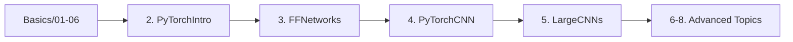

<p align="center">
  <h1 align="center">🧠 PadhAI Deep Learning Course</h1>
  <p align="center">
    <strong>A comprehensive deep learning course with PyTorch implementations</strong>
  </p>
  <p align="center">
    <a href="#-features"></a>
    <a href="#-getting-started"></a>
    <a href="#-notebooks"></a>
  </p>
  <p align="center">
    
    
    
    
  </p>
</p>

---

## 📑 Table of Contents

- [🎯 Overview](#-overview)
- [✨ Features](#-features)
- [📚 Course Structure](#-course-structure)
  - [🔬 Basics Module](#-basics-module)
  - [🚀 Advanced PyTorch Module](#-advanced-pytorch-module)
- [🛠️ Installation](#️-installation)
- [📓 Notebooks Guide](#-notebooks-guide)
- [🏆 Kaggle Competitions](#-kaggle-competitions)
- [📊 Datasets](#-datasets)
- [💡 Code Examples](#-code-examples)
- [🤝 Contributing](#-contributing)
- [📜 License](#-license)

---

## 🎯 Overview

Welcome to the **PadhAI Deep Learning Course** repository! This comprehensive course takes you on a journey from the fundamentals of neural networks to advanced deep learning architectures using **PyTorch**. Whether you're a beginner looking to understand the basics or an experienced practitioner wanting to solidify your knowledge, this course has something for everyone.

```
📦 PadhAI-DL-Course
├── 📁 Basics/              # Foundation notebooks (15 notebooks)
├── 📁 data/                # Datasets and competition links
├── 📓 1. Tensors.py        # GPU vs CPU performance comparison
├── 📓 2. PytorchIntro      # PyTorch fundamentals
├── 📓 3. FFNetworks        # Feed Forward Networks
├── 📓 4. PyTorchCNN        # Convolutional Neural Networks
├── 📓 5. LargeCNNs         # VGG, ResNet, Inception
├── 📓 6. CNNVisualisation  # Understanding CNNs
├── 📓 7. BatchNorm_Dropout # Regularization techniques
└── 📓 8. HyperparameterTuning_MLFlow # Experiment tracking
```

---

## ✨ Features

<table>
<tr>
<td>

### 🎓 Comprehensive Curriculum
- From basics to advanced topics
- Hands-on coding exercises
- Real-world applications

</td>
<td>

### 🔥 PyTorch Implementation
- Industry-standard framework
- GPU acceleration
- Modern best practices

</td>
</tr>
<tr>
<td>

### 📊 Visual Learning
- CNN visualization techniques
- Decision boundary plots
- Training progress visualization

</td>
<td>

### 🏋️ Practical Exercises
- Kaggle competitions
- Multiple datasets
- Progressive difficulty

</td>
</tr>
</table>

---

## 📚 Course Structure

### 🔬 Basics Module

The Basics module provides a solid foundation in neural networks and deep learning concepts:

| # | Notebook | Topics Covered |
|:-:|----------|----------------|
| 00 | **Assignments** | Practice problems with sigmoid functions and RMSE |
| 01 | **Python + Linear Algebra** | NumPy fundamentals, matrix operations |
| 02 | **MP Neuron & Perceptron** | Breast cancer classification, binary classifiers |
| 03 | **Sigmoid Neuron + GD** | Activation functions, gradient computation |
| 04 | **Gradient Descent** | Optimization fundamentals |
| 05 | **Sigmoid & GD** | Complete implementation |
| 06 | **Text Classification** | Level 1 classification challenge |
| 07 | **FeedForward Network (MLP)** | Multi-layer perceptrons from scratch |
| 08 | **Scalar Backpropagation** | Understanding backprop algorithm |
| 09 | **Vectorized FF Networks** | Efficient implementations |
| 10-12 | **GD Algorithms** | Various optimization techniques |
| 13 | **Initialization & Activations** | Weight initialization strategies |
| 14 | **Overfitting & Regularization** | L1, L2, and dropout techniques |

### 🚀 Advanced PyTorch Module

The main notebooks cover advanced PyTorch concepts and modern architectures:

<details>
<summary><b>📓 1. Tensors (GPU Performance)</b></summary>

Compare computational performance across different frameworks:

```python
import torch
import numpy as np

# GPU acceleration with PyTorch
cuda = torch.device('cuda:0')
a = torch.randn(10000, 10000, device=cuda)
b = torch.randn(10000, 10000, device=cuda)
c = torch.matmul(a, b)  # Lightning fast on GPU!
```

**Key Topics:**
- Tensor operations
- GPU vs CPU benchmarking
- NumPy vs PyTorch comparison

</details>

<details>
<summary><b>📓 2. PyTorch Introduction</b></summary>

Master the fundamentals of PyTorch:

```python
import torch

# Tensor Initialization
x = torch.ones(3, 2, requires_grad=True)

# Operations with autograd
y = x + 5
z = y * y + 1
t = torch.sum(z)
t.backward()

print(x.grad)  # Automatic differentiation!
```

**Key Topics:**
- Tensor initialization and operations
- Slicing and reshaping
- NumPy ↔ PyTorch interfacing
- CUDA support
- Automatic differentiation (Autograd)

</details>

<details>
<summary><b>📓 3. Feed Forward Networks with PyTorch</b></summary>

Build neural networks using PyTorch's powerful `nn` module:

```python
import torch.nn as nn

class FirstNetwork(nn.Module):
    def __init__(self, input_size, hidden_size, output_size):
        super(FirstNetwork, self).__init__()
        self.net = nn.Sequential(
            nn.Linear(input_size, hidden_size),
            nn.Sigmoid(),
            nn.Linear(hidden_size, output_size),
            nn.Sigmoid()
        )
    
    def forward(self, X):
        return self.net(X)
```

**Key Topics:**
- `nn.Module` and `nn.Sequential`
- Loss functions and optimizers
- Training loops
- GPU training

</details>

<details>
<summary><b>📓 4. Convolutional Neural Networks (LeNet)</b></summary>

Implement your first CNN for image classification:

```python
class LeNet(nn.Module):
    def __init__(self):
        super(LeNet, self).__init__()
        self.cnn_model = nn.Sequential(
            nn.Conv2d(3, 6, 5),    # 3 input channels, 6 output, 5x5 kernel
            nn.Tanh(),
            nn.AvgPool2d(2, 2),
            nn.Conv2d(6, 16, 5),
            nn.Tanh(),
            nn.AvgPool2d(2, 2)
        )
        self.fc_model = nn.Sequential(
            nn.Linear(400, 120),
            nn.Tanh(),
            nn.Linear(120, 84),
            nn.Tanh(),
            nn.Linear(84, 10)
        )
```

**Key Topics:**
- CIFAR-10 dataset
- DataLoader usage
- Convolutional layers
- Training and evaluation

</details>

<details>
<summary><b>📓 5. Large CNNs (Transfer Learning)</b></summary>

Work with state-of-the-art architectures:

```python
from torchvision import models

# Load pretrained VGG-16
vgg = models.vgg16_bn(pretrained=True)

# Freeze convolutional layers
for param in vgg.parameters():
    param.requires_grad = False

# Modify classifier for your task
vgg.classifier[6] = nn.Linear(4096, num_classes)
```

**Architectures Covered:**
- 🏛️ **VGG-16** - Deep convolutional networks
- 🔄 **ResNet-18** - Residual connections
- 🌟 **Inception v3** - Multi-scale feature extraction

</details>

<details>
<summary><b>📓 6. CNN Visualization</b></summary>

Understand what your CNNs are learning:

**Key Topics:**
- Custom dataset loading with `ImageFolder`
- Occlusion analysis
- Filter visualization
- Feature map inspection

</details>

<details>
<summary><b>📓 7. BatchNorm & Dropout</b></summary>

Master regularization techniques:

```python
# Batch Normalization
nn.BatchNorm2d(num_features)

# Dropout
nn.Dropout(p=0.5)
```

**Key Topics:**
- Batch normalization for faster training
- Dropout for regularization
- Comparison experiments

</details>

<details>
<summary><b>📓 8. Hyperparameter Tuning with MLFlow</b></summary>

Track and optimize your experiments:

```python
import mlflow
import mlflow.pytorch

# Log parameters and metrics
mlflow.log_param("learning_rate", lr)
mlflow.log_metric("accuracy", acc)

# Save models
mlflow.pytorch.log_model(model, "model")
```

**Key Topics:**
- MLFlow integration
- Parameter logging
- Metric tracking
- Model artifacts

</details>

---

## 🛠️ Installation

### Prerequisites

- Python 3.7+
- pip or conda
- CUDA-capable GPU (optional but recommended)

### Setup

```bash
# Clone the repository
git clone https://github.com/animikhaich/PadhAI-DL-Course.git
cd PadhAI-DL-Course

# Create virtual environment (recommended)
python -m venv venv
source venv/bin/activate  # On Windows: venv\Scripts\activate

# Install dependencies
pip install numpy pandas matplotlib seaborn scikit-learn
pip install torch torchvision
pip install jupyter tqdm mlflow
```

### Google Colab

All notebooks are designed to work with **Google Colab**! Simply:

1. Open the notebook in Colab
2. Enable GPU: `Runtime > Change runtime type > GPU`
3. Run all cells!

---

## 📓 Notebooks Guide

### Quick Start Path 🚀

For the best learning experience, follow this path:



1. **Week 1-2:** Complete `Basics/` notebooks 01-06
2. **Week 3:** Study `2. PytorchIntro.ipynb`
3. **Week 4:** Build networks with `3. FFNetworksWithPyTorch.ipynb`
4. **Week 5:** Learn CNNs with `4. PyTorchCNN.ipynb`
5. **Week 6:** Master transfer learning with `5. LargeCNNs.ipynb`
6. **Week 7+:** Explore visualization, regularization, and MLFlow

---

## 🏆 Kaggle Competitions

Test your skills in these Kaggle competitions:

| Competition | Description | Link |
|-------------|-------------|------|
| 🇮🇳 Hindi Vowel-Consonant | Character classification | [Join Competition](https://www.kaggle.com/c/padhai-hindi-vowel-consonant-classification) |
| 🇮🇳 Tamil Vowel-Consonant | Character classification | [Join Competition](https://www.kaggle.com/c/padhai-tamil-vowel-consonant-classification) |
| 📝 Text-Non Text Level 1 | Text detection | [Join Competition](https://www.kaggle.com/c/padhai-module1-level-1) |
| 📝 Text-Non Text Level 2 | Text detection | [Join Competition](https://www.kaggle.com/c/padhai-module1-level2) |
| 📝 Text-Non Text Level 3 | Text detection | [Join Competition](https://www.kaggle.com/c/padhai-module1-level3) |
| 📝 Text-Non Text Level 4a | Advanced text detection | [Join Competition](https://www.kaggle.com/c/padhai-module1-level4a) |
| 📝 Text-Non Text Level 4b | Advanced text detection | [Join Competition](https://www.kaggle.com/c/padhai-module1-level4b) |

---

## 📊 Datasets

The course uses several datasets:

```
📁 data/
├── 📄 mobile_cleaned.csv    # Mobile price dataset
├── 📦 padhai-module1-level-1.zip
├── 📦 padhai-module1-level-2.zip
├── 📦 CNN Visualization.zip  # Images for visualization
└── 📄 Dataset Links.json    # All dataset links
```

### Built-in Datasets Used

- **CIFAR-10**: 60,000 32x32 color images in 10 classes
- **MNIST**: 70,000 handwritten digits
- **Breast Cancer Wisconsin**: Classification dataset
- **Synthetic Blobs**: Generated using `sklearn.datasets.make_blobs`

---

## 💡 Code Examples

### Complete Training Loop

```python
import torch
import torch.nn as nn
import torch.optim as optim

# Setup
device = torch.device("cuda" if torch.cuda.is_available() else "cpu")
model = YourModel().to(device)
criterion = nn.CrossEntropyLoss()
optimizer = optim.Adam(model.parameters(), lr=0.001)

# Training loop
for epoch in range(num_epochs):
    model.train()
    for inputs, labels in trainloader:
        inputs, labels = inputs.to(device), labels.to(device)
        
        optimizer.zero_grad()
        outputs = model(inputs)
        loss = criterion(outputs, labels)
        loss.backward()
        optimizer.step()
    
    # Evaluation
    model.eval()
    with torch.no_grad():
        correct, total = 0, 0
        for inputs, labels in testloader:
            inputs, labels = inputs.to(device), labels.to(device)
            outputs = model(inputs)
            _, predicted = torch.max(outputs.data, 1)
            total += labels.size(0)
            correct += (predicted == labels).sum().item()
        
        print(f'Epoch {epoch+1}, Accuracy: {100*correct/total:.2f}%')
```

### Transfer Learning Template

```python
from torchvision import models

# Load pretrained model
model = models.resnet18(pretrained=True)

# Freeze all layers
for param in model.parameters():
    param.requires_grad = False

# Replace final layer
num_features = model.fc.in_features
model.fc = nn.Linear(num_features, num_classes)

# Only train the new layer
optimizer = optim.Adam(model.fc.parameters(), lr=0.001)
```

---

## 🤝 Contributing

Contributions are welcome! Here's how you can help:

1. 🐛 **Report bugs** - Open an issue describing the problem
2. 💡 **Suggest features** - Share your ideas for improvements
3. 📝 **Improve documentation** - Help make the docs clearer
4. 🔧 **Submit PRs** - Fix bugs or add new features

### Development Setup

```bash
# Fork and clone
git clone https://github.com/YOUR_USERNAME/PadhAI-DL-Course.git
cd PadhAI-DL-Course

# Create a branch
git checkout -b feature/your-feature-name

# Make changes and commit
git add .
git commit -m "Add your feature"

# Push and create PR
git push origin feature/your-feature-name
```

---

## 📜 License

This project is intended for **educational purposes**. Please respect the original authors and cite appropriately when using this material.

---

<p align="center">
  <b>Happy Learning! 🎉</b>
</p>

<p align="center">
  Made with ❤️ for the deep learning community
</p>

<p align="center">
  <a href="#-padhai-deep-learning-course">⬆️ Back to Top</a>
</p>
